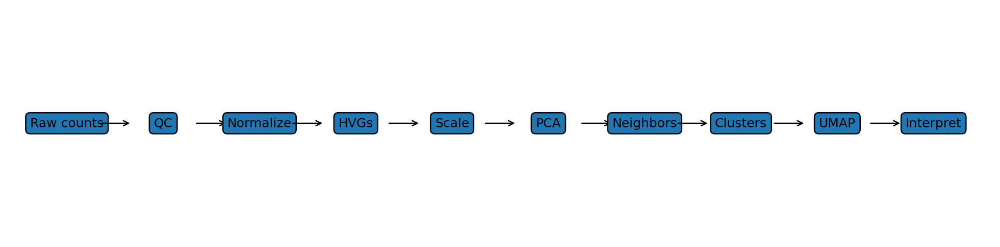

{fig-alt="scRNA-seq analysis workflow" width=100%}

## What this workshop teaches

This workshop is designed for biomedical researchers who want to understand **what the major scRNA-seq analysis steps are actually doing**, not just which Seurat commands to run. We use a tumor/immune-cell framing throughout, with repeated T-cell examples and a final TCR integration module.

By the end, participants should be able to explain and implement the logic of:

1. count matrices, UMIs, and quality control;
2. normalization and highly variable feature selection;
3. scaling and regression;
4. PCA, gene loadings, cell scores, and `dims`;
5. nearest-neighbor graphs, clustering, and `resolution`;
6. UMAP and what its geometry can and cannot tell you;
7. cluster markers and cell-type/state annotation;
8. subsetting, reintegration, differential expression, and pseudobulk;
9. scRNA-seq/TCR-seq integration and clonotype-state analysis.

::: {.callout-note}
### Teaching philosophy
Every module uses the same sequence: **problem → computation → code → biological example → interpretation → common mistake → exercise**.
:::

## Data used in the exercises

The repository includes a small synthetic immune dataset in `data/` so participants can run the workflow without downloading protected or very large datasets. The metadata intentionally includes donor, condition, tissue, reference cell type/state, and TCR clonotype fields so later statistical and TCR exercises are possible.

## Suggested formats

- **One-day intensive:** 6–7 hours plus breaks.
- **Two half-days:** foundations on Day 1; clustering, interpretation, statistics, and TCR on Day 2.
- **Graduate course:** one module per class with the exercises assigned between sessions.
