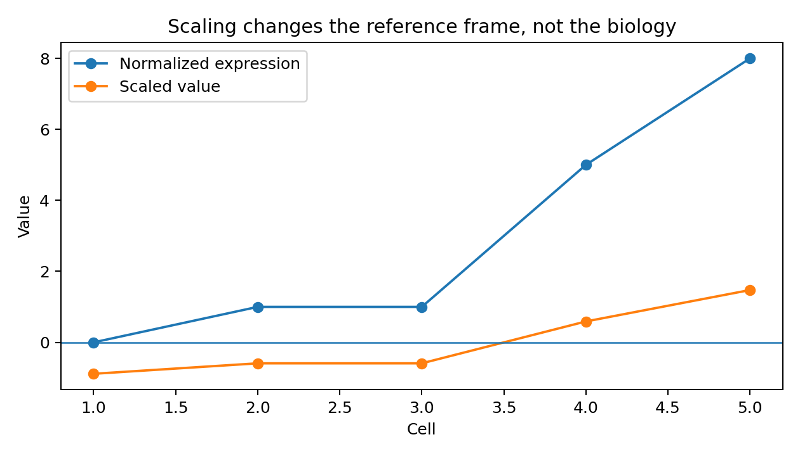

## Why scaling exists

After normalization, expression is more comparable across cells, but genes still have different means and variances. PCA is a variance-based method, so genes with larger numerical variance can dominate the analysis simply because of their scale.

A useful shorthand is:

> **Normalization helps compare cells; scaling helps compare gene-level variation.**

## Centering and variance scaling

For each gene independently, Seurat approximately transforms expression as:

\[
z_{i,j}=\frac{x_{i,j}-\bar{x}_{j}}{s_j}
\]

where `x` is normalized expression for gene `j` in cell `i`, `mean` is that gene's mean across the analyzed cells, and `s` is that gene's standard deviation.

After scaling:

- `0` means approximately average expression for that gene;
- `+1` means one standard deviation above the gene's mean;
- `-1` means one standard deviation below the gene's mean.

{width=75% fig-alt="normalized and scaled values"}

## Concrete NKG7 example

Suppose normalized NKG7 values across five cells are `0, 1, 1, 5, 8`. If the mean is near 3 and the standard deviation near 3.4, the cell with value 8 receives a scaled value around `+1.5`.

That does **not** mean 1.5 transcripts or 150% expression. It means NKG7 is high relative to NKG7's own distribution across the cells used for scaling.

```r
obj <- ScaleData(obj)
```

## Why this matters for PCA

Imagine two transcriptional programs:

- naive/memory: `CCR7`, `TCF7`, `IL7R`, `LTB`
- cytotoxic: `NKG7`, `GNLY`, `PRF1`, `GZMB`

Their normalized ranges can be very different. Scaling prevents genes with intrinsically larger variance from dominating solely because of numerical magnitude, allowing PCA to detect coordinated relative changes.

## Gene-by-gene reference frames

If a cell has:

- NKG7 scaled = `+2.0`
- CD3D scaled = `+0.5`

it is incorrect to say the cell expresses four times more NKG7 than CD3D. Correct interpretation:

> NKG7 is much farther above its own dataset-wide mean than CD3D is above its own mean.

## Why heatmaps often use scaled values

Heatmaps frequently display values around `-2 ... 0 ... +2` because they emphasize **where each gene is relatively high or low**. Compare across cells/clusters for the same row; do not use scaled values as absolute expression comparisons across genes.

## Regression during scaling

```r
obj <- ScaleData(
  obj,
  vars.to.regress = c("percent.mt")
)
```

When covariates are supplied, Seurat models their relationship with each gene and then scales/centers residual variation. This can be useful when a variable represents unwanted variation, but regression can also erase real biology.

For example, regressing out S and G2M scores may be inappropriate if proliferating T cells are themselves biologically central to the experiment.

## Subsetting changes the scaling reference

If you scale all immune cells, the NKG7 mean is calculated across T cells, NK cells, B cells, and myeloid cells. If you then subset T cells and rescale, the NKG7 mean is recalculated using T cells only. The same cell can therefore have a different scaled NKG7 value without any biological change.

That is one reason T-cell reclustering commonly reruns HVG selection, scaling, and PCA.

::: {.callout-warning}
Never regress out a covariate simply because software offers the option. First decide whether the variable is nuisance variation or part of the biological signal you intend to study.
:::
