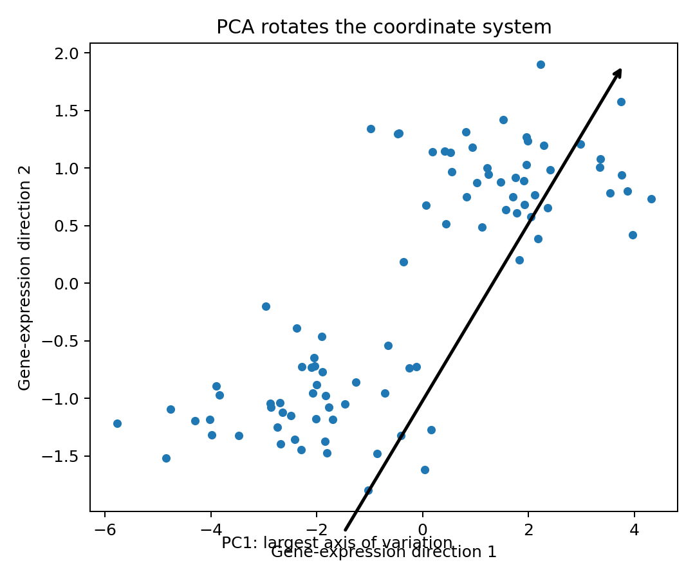

## The dimensionality problem

If PCA uses 2,000 variable genes, every cell initially occupies a 2,000-dimensional gene-expression space. PCA creates a smaller set of orthogonal axes that capture progressively smaller amounts of variance.

{width=70%}

## A principal component is a weighted combination of genes

A simplified component might be:

\[
PC_3=0.31(NKG7)+0.29(GNLY)+0.25(PRF1)-0.21(CCR7)-0.19(IL7R)+\cdots
\]

The coefficients are **gene loadings**. Large absolute loadings mean a gene contributes strongly to that PC; the sign indicates direction along the axis.

```r
obj <- RunPCA(obj, features = VariableFeatures(obj))
VizDimLoadings(obj, dims = 1:5, reduction = "pca")
Loadings(obj, reduction = "pca")[1:10, 1:5]
```

## Does a loading account for every cell?

Yes. The loading is learned from how each input gene varies across **all cells included in that PCA calculation**. Once the axes are learned, every cell receives a **PC score** locating it along each axis.

- Gene loading: *what defines the PC?*
- Cell score: *where does this cell lie on that PC?*

## What PC1, PC2, PC3 mean

PC1 captures the greatest variance. PC2 captures the greatest remaining variance subject to being orthogonal to PC1, and so on.

In an immune dataset, an illustrative sequence might be:

- PC1: myeloid ↔ lymphoid
- PC2: B ↔ T
- PC3: naive/memory ↔ cytotoxic
- PC4: interferon response
- PC5: proliferation

These labels are interpretations from the loadings; PCA does not know biological terminology.

## "Major contributing genes" has no universal cutoff

A common practice is to inspect the largest positive and negative loadings or the largest absolute loadings. There is no universal loading threshold such as 0.2 that defines biological importance.

## Choosing `dims`

```r
ElbowPlot(obj, ndims = 50)
obj <- FindNeighbors(obj, dims = 1:30)
```

`dims = 1:30` means the neighborhood graph will use the first 30 PCs—not 30 genes.

Using too few PCs can collapse subtle biology; using too many can admit weak technical/noisy structure. Examine variance, PC loadings, stability of downstream results, and the biological complexity of the dataset.

::: {.callout-important}
The largest source of variance is not automatically the most biologically important. A rare but clinically important cell state can be relegated to a later PC because it affects relatively few cells.
:::
