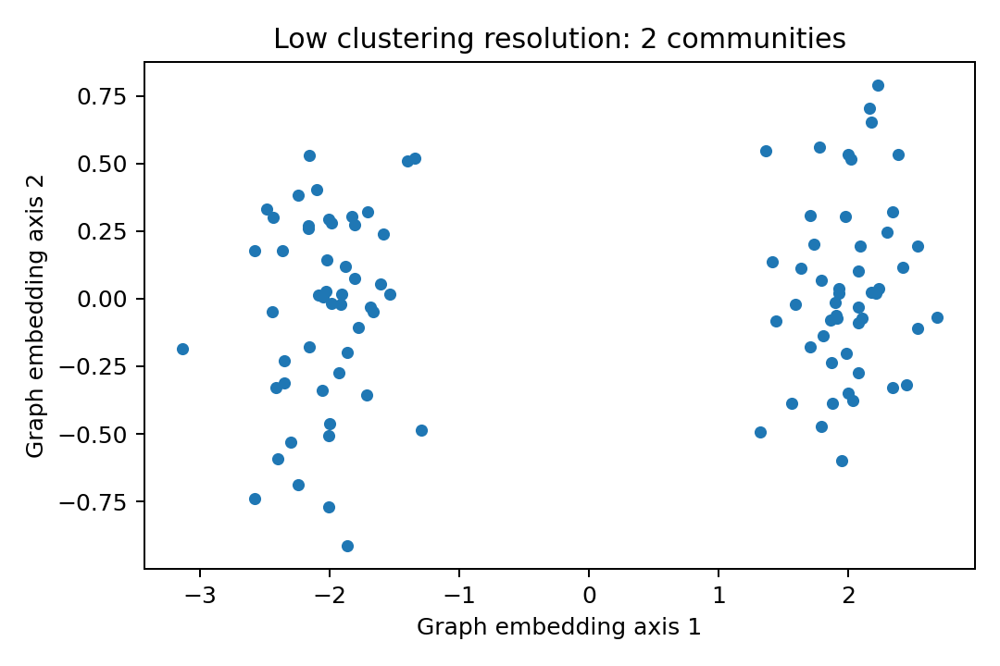
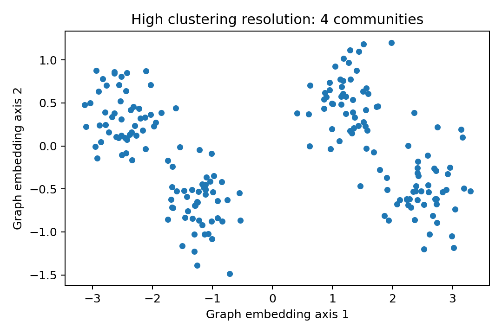

## From PCA coordinates to a similarity graph

After PCA, a cell might be represented by 30 numbers rather than 2,000 genes. `FindNeighbors()` identifies nearby cells in this PCA space and constructs neighbor/SNN graphs.

```r
obj <- FindNeighbors(obj, dims = 1:30)
```

Conceptually, each cell is a node; edges connect cells with similar local neighborhoods. Shared-nearest-neighbor weighting strengthens relationships that are supported by overlapping neighborhoods rather than one accidental proximity.

## Clustering finds communities in that graph

```r
obj <- FindClusters(obj, resolution = 0.6)
```

The clustering algorithm does not ask whether a cell is a T cell or monocyte. It asks which sets of nodes are more densely connected to one another than to the rest of the graph.

## What `resolution` means

Resolution tunes the granularity of graph partitioning.

{width=49%} {width=49%}

Higher resolution generally produces more/smaller communities; lower resolution produces fewer/larger communities.

It is not a probability, p-value, image resolution, or accuracy score.

## Overclustering and underclustering

A split is more convincing when the daughter clusters:

- persist across nearby resolutions;
- have coherent multi-gene programs;
- are represented across multiple biological samples;
- are not defined only by mitochondrial/ribosomal genes, one donor, or extremely small cell numbers;
- correspond to a plausible discrete state rather than arbitrary slices of a continuum.

## `dims` and `resolution` solve different problems

- `dims`: **what information defines similarity?**
- `resolution`: **how finely do we partition that similarity graph?**

Changing either can change the final clusters, but for different reasons.

## Sensitivity exercise

Try combinations such as:

```r
for (res in c(0.2, 0.4, 0.6, 0.8, 1.0)) {
  obj <- FindClusters(obj, resolution = res)
}
```

Then inspect whether biologically important groups are stable or appear only under one parameter setting.
