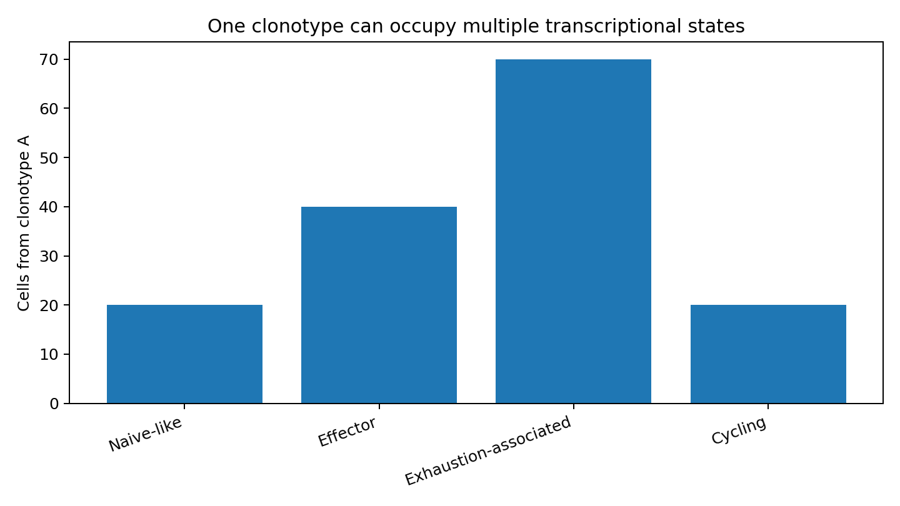

## Two orthogonal questions

scRNA-seq tells us: **what state is this cell in?**

TCR-seq tells us: **which clonal lineage does this T cell belong to?**

Integrating them allows us to ask whether the same clonotype occupies multiple states, whether expanded clones are enriched in particular tissues/states, and whether clones are shared between compartments.

{width=75%}

## Clone size is not tumor specificity

An expanded clone can be tumor-reactive, viral-specific, bystander, or responding to another antigen. Expansion is evidence of clonal proliferation—not proof of antigen identity.

## Useful analyses

1. clone-size distribution by tissue;
2. clonotype overlap between blood and tumor;
3. state occupancy within clonotypes;
4. phenotype of expanded vs singleton clones;
5. donor-aware comparisons of clonal diversity;
6. functional validation for claims of tumor reactivity.

## Workshop metadata example

```r
head(obj@meta.data[, c(
  "donor", "tissue", "truth_cell_type", "truth_state", "clonotype"
)])
```

For a single clonotype:

```r
subset(
  obj@meta.data,
  clonotype == "clonotype_A"
) |>
  table(useNA = "ifany")
```

## A stronger biological statement

Weak: "Clonotype A is exhausted."

Stronger: "Clonotype A occupies several transcriptional states but is enriched in the exhaustion-associated compartment in tumor tissue."

The latter respects the fact that clonotype identity and transcriptional phenotype are related but not equivalent.
